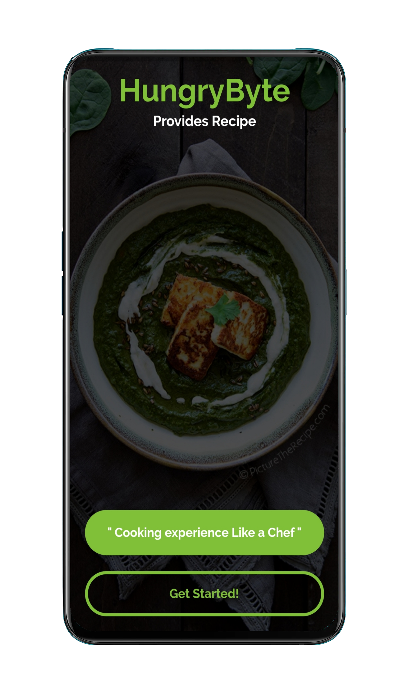
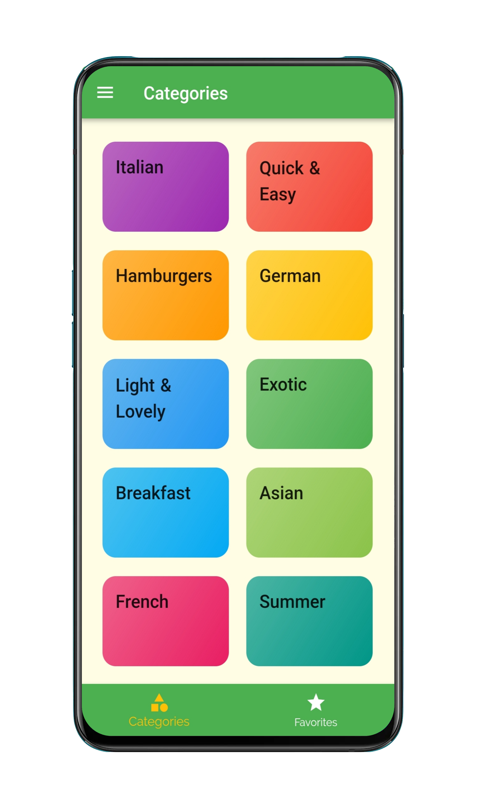
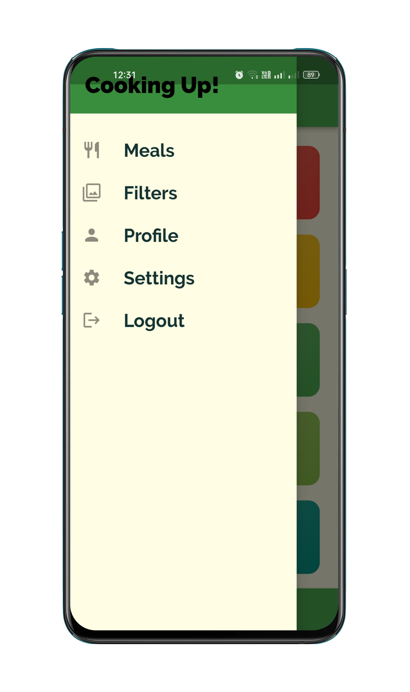
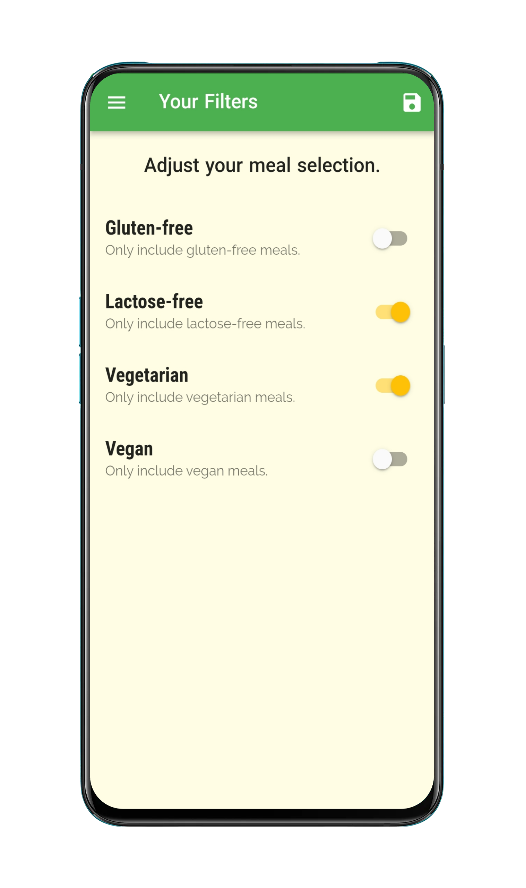
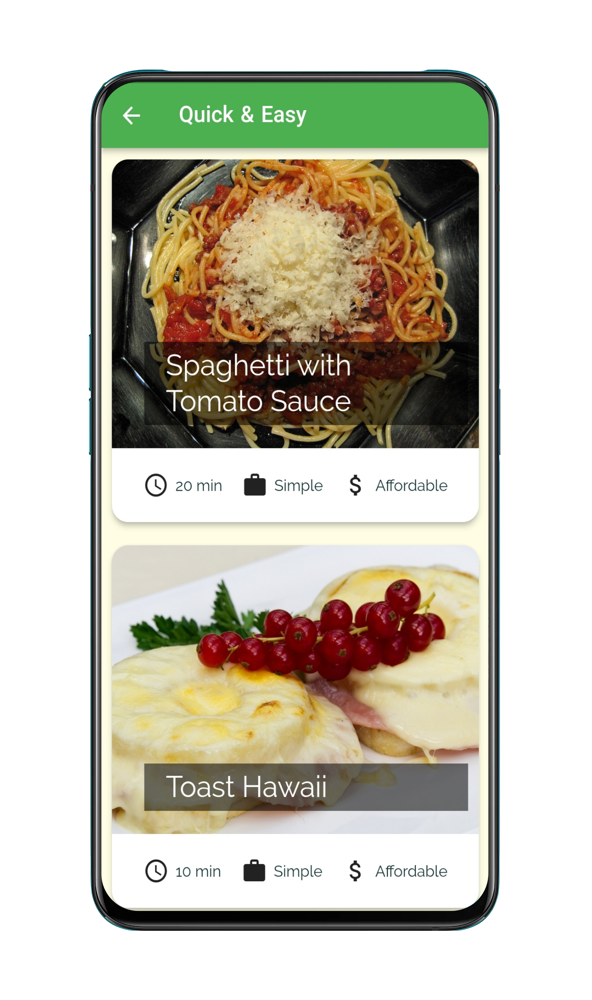
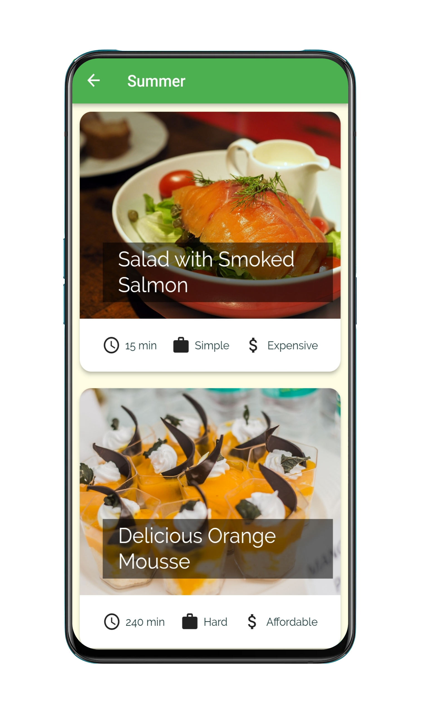
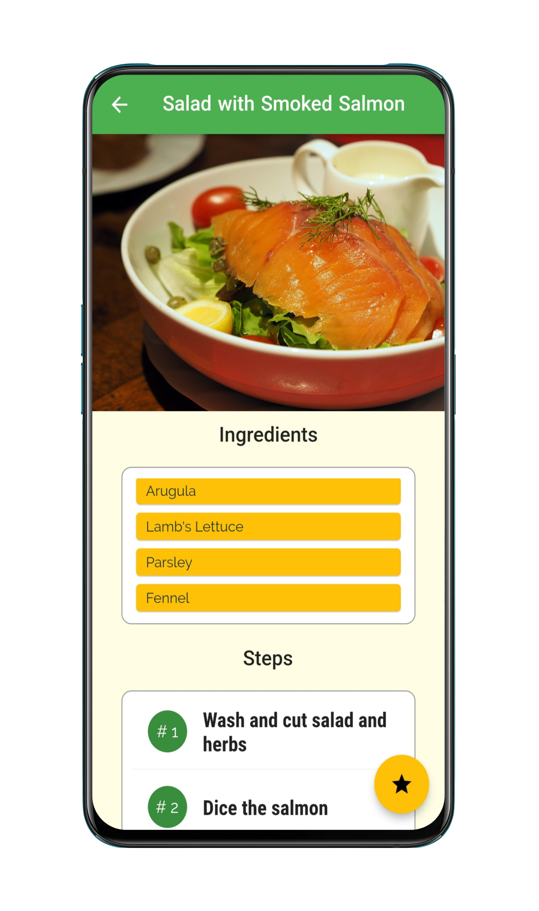
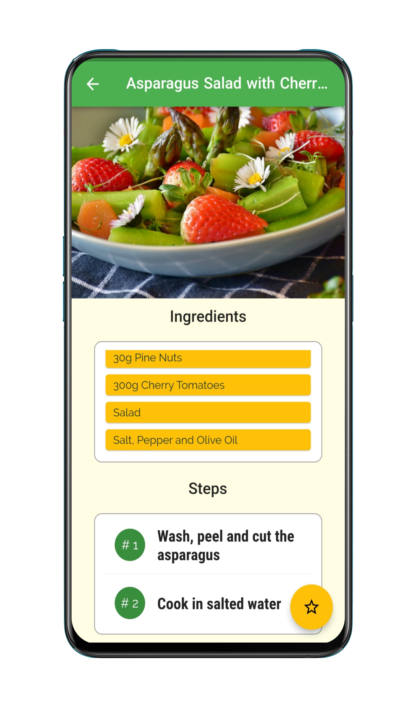
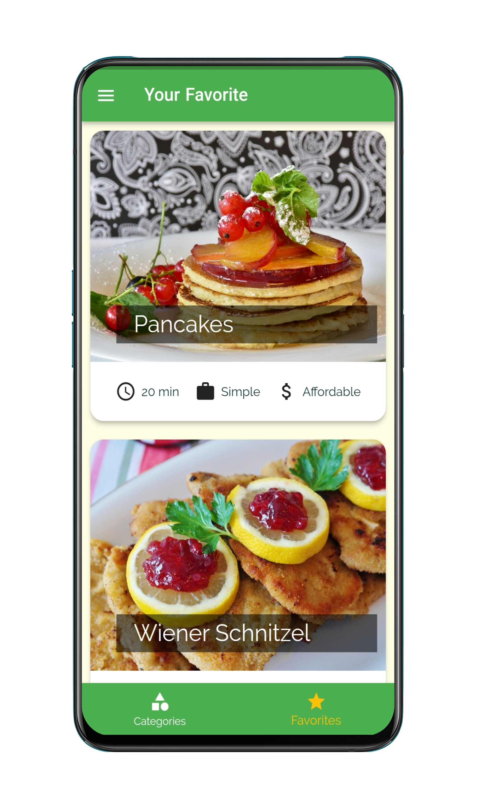

<h1 align="center">HungryByte- Recipe App

</h1>

## ➼ Description:
It provides recipe and other useful information for some of the popular delicious dishes. You can filter out different recipes according to your requirement and even mark them as favorite in case you find something interesting.

<h4 align="left">Languages and Tools:</h4>
 
Dart

 
Flutter

Visual Studio Code

## ➼ Techincal:
- `helpers` folder contains a class to define the App Color.
- `models` folder contains classes to define a: categories(id - title - color) and meals(Complexity - Affordability - id - imageURL - ingredients - steps - duration).
- `screens` folder contains snippets of code for various pages like category_screen, category_meal, favourites_screen , filters_screen , meal_detailsScreen, tabs_screen.
- `widgets` folder contains the meal_item screen, welcome_screen code etc.

## ➼ Overview:
This project has several features:

- `Welcome Screen` which is an initial screen that gets displayed right when the user launches the app.
- `Categories Screen` a screen with a list of categories placed in two columns. Each Category card has a fixed width and height. Then there is space between the cards and horizontal padding as well.
- `Drawer Screen` The navigation drawer is a UI panel that shows your app’s main navigation menu. It is hidden when not in use, but appears when the user swipes a finger from the left edge of the screen or, when at the top level of the app, the user touches the drawer icon in the app bar.
- `Filter Screen` provide utility to search/filter on the basis of single/multiple selection from provided dynamic list.
- `Category Meals Screen` shows a selection of meals based on that particular season or type.
- `Meal Detail Screen` consist of a header to display recipe name, tabs containing ingredients and preparation steps and a floating button that enables us to add that recipe to our favorites.
- `Favorites Screen` this page will consist of saved recipes that are liked by us.

## ➼ Screenshots:

|             Welcome Screen               |                Category Screen            |               Drawer Screen               | 
| :--------------------------------:       | :---------------------------------------: | :---------------------------------------: |
|     |   |       |

|                Filter Screen             |             Category Meal Screen 1        |          Category Meal Screen 2           | 
| :--------------------------------:       | :---------------------------------------: | :---------------------------------------: |
|     |          |          |

|            Meal Details Screen 1         |             Meal Details Screen 2         |              Favorites Screen             | 
| :--------------------------------:       | :---------------------------------------: | :---------------------------------------: |
|       |        |   |
